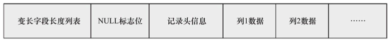

# InnoDB行记录格式

InnoDB表记录是以行的形式存储的。这意味着页中保存的数据是一行行的数据。

可以使用下面的命令来查看表的行格式

```
show table status like "表名称"。
```
InnoDB行记录格式就是数据库页中行记录的组织规则。主要有两种：

- Compact，最常用的行记录的格式。

- Redundant，兼容之前的行记录格式而保留的。


## Compact行记录格式
下图显示了commpact行的存储方式



### 非null字段变长字段长度列表
Compact行记录格式首部是一个列表，这个列表存放的是**非null**字段的**长度**列表，并且是按照数据库字段的**倒序**放置的。若列的长度小于255个字节用一个1字节表示其长度，否者用2个字节表示。由此可以看出变长字段的最大长度是:**Math.pow(2,2*8)=65535**。


### null标识位

该行数据是否有null值，有则用1表示，否者为0。该部分占一个字节

###记录头信息

该部分固定占5个字节，几个重要的头信息为：

1. deleted_flag,该行是否已经被删除

2. min_rec_flag，该记录是否被预先定义为最小记录

3. n_owned，拥有的记录数

4. heap_no,索引堆中该条记录的排序记录

5. record_type，记录类型。

6. next_record，页中下一条记录的相对位置。


### 每个列(数据库字段)数据

null不占该部分的任何空间。


每行数据除了用户自定义的字段列以外，还有两个隐藏的列:

1. 数据id列，占6个字节，
2. 回滚指针列，占7个字节，
3. 主键列，如果InnoDB表没有定义主键的话。

